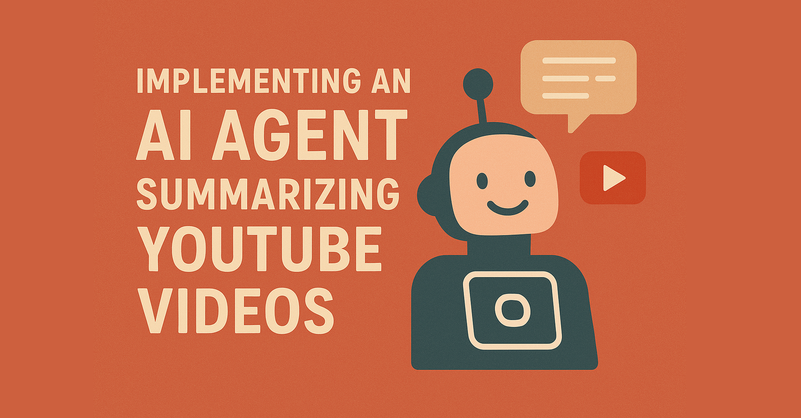

# YouTube Agents with Neuron AI PHP framework

This repository contains the PHP implementation of an AI Agents summarizing YouTube videos. 
It is built using the [Neuron AI](https://github.com/inspector-apm/neuron-ai) package. 

> Read the full article: https://inspector.dev/php-ai-agent-summarizing-youtube-videos/



# YouTube Agent Use Cases
Let's explore three real-world contexts where YouTube video summarization can be incredibly helpful.

## Educational Context
Students, teachers, and researchers often need to extract key information from lengthy educational content. The YouTube Agent could help:

- Students can quickly determine if a 2-hour lecture contains the specific topic they're researching.
- Teachers can preview educational content before assigning it to students, ensuring relevance and quality.
- Researchers can efficiently process multiple conference presentations without watching them in full.

## Content Creation and Media Monitoring
Creators and media professionals can use this Agent to:

- Journalists can quickly analyze trending video discussions without full viewing.
- Content creators can automate description generation for their contents.
- Social media managers can automate posts generation from YouTube videos ensuring more relevant content creation.

Just give you some inspiration. You can eventually share your implementation of the Neuron AI forum: 
https://github.com/inspector-apm/neuron-ai/discussions

# Introducing the Neuron AI PHP framework
Neuron is a fantastic PHP package that allows you to create full featured AI Agents in PHP in a few lines of code. 
It definitively fills the gap for AI Agents development between PHP and other ecosystems like Python or Javascript.

It provides you a standard toolkit to implement AI driven applications drastically reducing vendor lock-in. 
You can switch between LLMs, vector stores, embedding providers, etc. with just a few lines of code without the 
need to refactor big portions of your application.

Also, being able to encapsulate the full implementation of the Agent into a single class makes it so easy 
to add AI features within your existing PHP application.

If you are new to AI Agents development, or you already have experience Neuron can be the perfect playground 
to move your idea from experiments to extensive production implementations.

Here is the link to the documentation: https://docs.neuron-ai.dev

# How to use this package

Download the project on your machine, and open your terminal into the project directory.
First install the composer dependencies:

```
composer install
```

To interact with the agent, you can just run the `youtube.php` script:

```
php .\youtube.php
```

